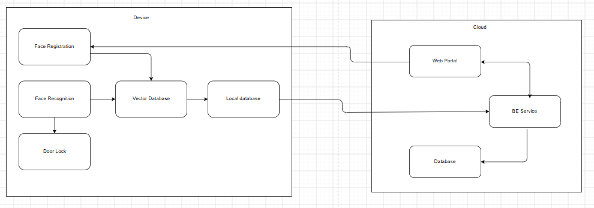

# Hệ thống nhận diện khuôn mặt kiểm soát ra vào

## Giới thiệu

Đây là dự án xây dựng hệ thống kiểm soát cửa bằng nhận diện khuôn mặt trên nền tảng phần cứng nhúng. Hệ thống cho phép đăng ký khuôn mặt, nhận diện người dùng tại cửa, tự động quyết định cho phép hoặc từ chối truy cập và điều khiển khóa cửa.

Kiến trúc được chia thành hai phần chính:

- **Device (Edge):** hoạt động trực tiếp tại cửa, gồm camera, ứng dụng nhận diện, cơ sở dữ liệu cục bộ, màn hình, khóa cửa và cảm biến cửa.
- **Cloud:** cung cấp backend, cơ sở dữ liệu tập trung và web portal để quản lý người dùng, khuôn mặt, thiết bị, cấu hình và lịch sử ra vào.

Device có thể nhận diện và kiểm soát cửa ở chế độ offline. Khi có kết nối, dữ liệu người dùng, cấu hình và nhật ký truy cập sẽ được đồng bộ hai chiều với Cloud thông qua HTTPS.

## Chức năng chính

- Đăng ký và quản lý khuôn mặt người dùng.
- Phát hiện, xử lý và tạo face embedding từ hình ảnh camera.
- Tìm kiếm embedding cục bộ và đưa ra quyết định truy cập.
- Điều khiển khóa cửa, hiển thị kết quả và theo dõi trạng thái cửa.
- Lưu trữ cục bộ để hệ thống vẫn hoạt động khi mất kết nối.
- Đồng bộ dữ liệu giữa Device và Cloud.
- Quản trị người dùng, thiết bị, cấu hình và lịch sử truy cập qua Web Portal.

## Kiến trúc hệ thống

Sơ đồ luồng tổng quát:

## Luồng hoạt động

1. Quản trị viên tạo phiên đăng ký khuôn mặt trên Web Portal.
2. Device thu nhận hình ảnh, xử lý khuôn mặt và lưu embedding vào cơ sở dữ liệu cục bộ.
3. Khi người dùng đứng trước cửa, camera chụp ảnh và Device thực hiện nhận diện.
4. Nếu hợp lệ, hệ thống mở khóa và ghi lại nhật ký truy cập; nếu không hợp lệ, quyền truy cập bị từ chối.
5. Device đồng bộ nhật ký, dữ liệu người dùng và cấu hình với Cloud khi có kết nối.

## Tài liệu

- [Tài liệu kiến trúc hệ thống](docs/face_recognition_access_control_architecture.md)
