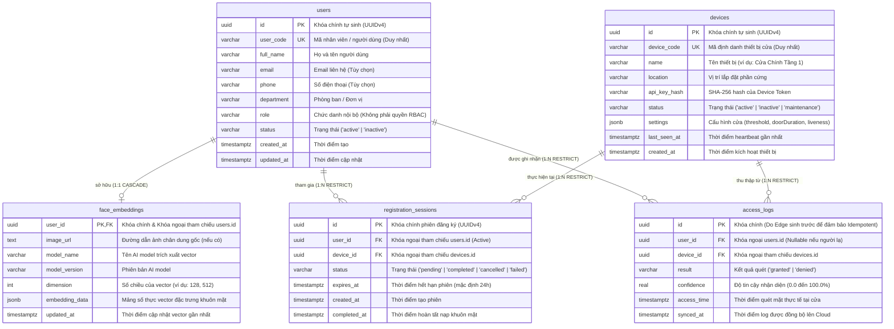
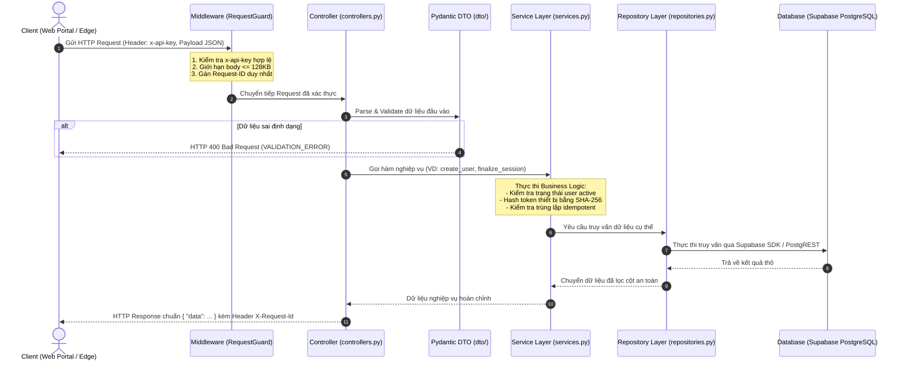
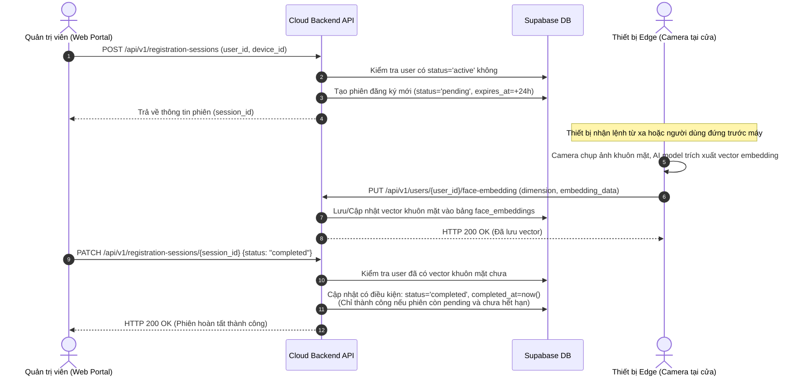
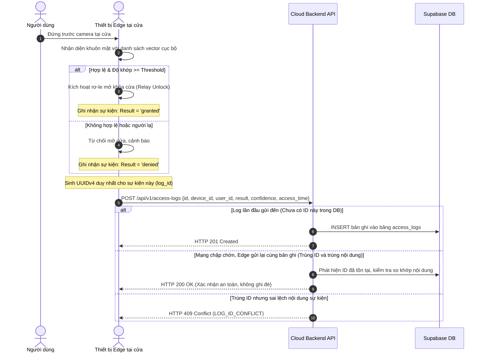

# Tài liệu Kiến trúc & Vận hành Backend (FaceAccess API)

Tài liệu này mô tả chi tiết kiến trúc hệ sinh thái Backend, thiết kế cơ sở dữ liệu, tổ chức mã nguồn và các luồng nghiệp vụ cốt lõi của **Hệ thống Kiểm soát Ra vào bằng Nhận diện Khuôn mặt (FaceAccess System)**. Tài liệu phục vụ cho việc phát triển, kiểm thử, tích hợp hệ thống phần cứng (Edge) và thuyết trình/giải trình với các bên đối tác, hội đồng hoặc ban quản lý.

---

## 1. Tổng quan Hệ thống (System Overview)

Hệ thống hoạt động theo mô hình **Edge-to-Cloud**:
* **Edge (Thiết bị tại cửa):** Chịu trách nhiệm chụp ảnh, phát hiện khuôn mặt, trích xuất vector embedding và so khớp cục bộ để mở khóa cửa tức thì (hỗ trợ offline).
* **Cloud Backend (FastAPI + Supabase):** Đóng vai trò máy chủ trung tâm quản trị người dùng, thiết bị, lưu trữ tập trung vector đặc trưng khuôn mặt (face embeddings), điều phối phiên đăng ký mới và thu thập nhật ký truy cập (access logs).

### Công nghệ cốt lõi
* **Ngôn ngữ & Framework:** Python 3.12, FastAPI (Asynchronous Web Framework), Uvicorn (ASGI Server).
* **Cơ sở dữ liệu:** Supabase (Managed PostgreSQL) kết nối thông qua Supabase Python SDK + HTTPX Client pooling.
* **Xác thực & Ràng buộc:** Pydantic v2 (Strict validation DTOs), Hashlib (SHA-256 device token hash), UUIDv4.

---

## 2. Thiết kế Cơ sở Dữ liệu (Database Architecture & ERD)

Cơ sở dữ liệu gồm 5 bảng chính trong schema `public`, được thiết kế tối ưu cho tính toàn vẹn dữ liệu, chống trùng lặp và hỗ trợ thiết bị Edge đồng bộ mượt mà:



### Các nguyên tắc toàn vẹn dữ liệu:
1. **Quan hệ 1:1 giữa `users` và `face_embeddings`**: Mỗi người dùng chỉ có duy nhất một vector nhận diện đại diện trên hệ thống. Khi xóa người dùng, bản ghi vector khuôn mặt sẽ tự động bị xóa theo (`ON DELETE CASCADE`).
2. **Bảo vệ toàn vẹn lịch sử (`RESTRICT`)**: Không cho phép xóa người dùng hoặc thiết bị nếu còn tồn tại phiên đăng ký (`registration_sessions`) hoặc lịch sử quẹt thẻ/mặt (`access_logs`). Điều này đảm bảo lịch sử an ninh không bao giờ bị đứt gãy dữ liệu tham chiếu.
3. **Cơ chế Idempotency cho `access_logs`**: Khóa chính `id` là UUID được tạo trực tiếp tại thiết bị Edge ngay khi sự kiện diễn ra. Khi mạng chập chờn và thiết bị gửi lại log cũ nhiều lần, backend sẽ kiểm tra so khớp nội dung và trả về HTTP 200 thay vì ghi đè hoặc báo lỗi duplicate.

---

## 3. Kiến trúc Phân tầng & Tổ chức Code (Code Organization)

Mã nguồn Backend được xây dựng theo mô hình **Layered Architecture (Kiến trúc phân tầng)** kết hợp **Dependency Injection** thông qua application state của FastAPI.

```
backend/
├── app/
│   ├── config.py                 # Nạp và kiểm tra biến môi trường (.env), timeouts, host/port
│   ├── controllers.py            # Tầng Controller (Định tuyến API, parse HTTP parameters)
│   ├── services.py               # Tầng Service (Xử lý nghiệp vụ, hash token, logic idempotent)
│   ├── repositories.py           # Tầng Repository (Thao tác truy vấn trực tiếp 5 bảng Supabase)
│   ├── middleware.py             # Middleware bảo mật: x-api-key, request ID, giới hạn payload 128KB
│   ├── errors.py                 # Chuẩn hóa và ánh xạ lỗi từ Database/SDK sang lỗi ứng dụng
│   ├── main.py                   # App factory, cấu hình lifespan, quản lý kết nối DB và static files
│   ├── dto/                      # Data Transfer Objects (Pydantic schema validate chặt chẽ)
│   │   ├── access_logs.py
│   │   ├── devices.py
│   │   ├── face_embeddings.py
│   │   ├── registration_sessions.py
│   │   └── users.py
│   └── infrastructure/
│       └── database.py           # Quản lý kết nối Supabase Client, HTTPX pool và health check
├── scripts/                      # Các công cụ CLI hỗ trợ quản trị và kiểm tra
│   ├── check_database.py         # Kiểm tra kết nối và tính sẵn sàng của 5 bảng database
│   ├── request_api.py            # CLI test API nhanh với x-api-key từ dòng lệnh
│   └── seed_users.py             # Sinh 50 người dùng mẫu chuẩn Việt Nam (40 active, 10 inactive)
├── tests/                        # Bộ kiểm thử tích hợp (Integration tests & Pytest)
├── Dockerfile                    # Containerization cho backend Python 3.12
├── requirements.txt              # Thư viện phụ thuộc cho môi trường Production
└── run.py                        # Điểm khởi chạy chính của ứng dụng Uvicorn
```

### Luồng xử lý một Request qua các tầng:



---

## 4. Các Luồng Nghiệp Vụ Cốt Lõi (Core Business Workflows)

### Luồng 1: Đăng ký & Nạp vector khuôn mặt mới (Face Enrollment Flow)



---

### Luồng 2: Xác thực Mở cửa & Thu thập Nhật ký Idempotent (Access & Log Sync Flow)



---

## 5. Đặc tả API Endpoints & Chuẩn Phản Hồi

Toàn bộ API được đặt dưới tiền tố `/api/v1` và yêu cầu header bảo mật `x-api-key`.

### Danh sách Endpoint:

| Nhóm | Phương thức | Endpoint | Mô tả |
| :--- | :--- | :--- | :--- |
| **Health** | `GET` | `/health` | Kiểm tra kết nối và trạng thái sẵn sàng của 5 bảng Database |
| **Users** | `GET` | `/users` | Lấy danh sách toàn bộ người dùng (lọc theo `department`, `status`) |
| | `POST` | `/users` | Tạo mới hồ sơ nhân sự |
| | `GET` | `/users/{id}` | Lấy chi tiết một người dùng |
| | `PATCH` | `/users/{id}` | Cập nhật thông tin (chỉ gửi trường cần sửa) |
| | `DELETE` | `/users/{id}` | Xóa người dùng (Tự xóa vector; cấm xóa nếu có session/log) |
| **Devices** | `GET` | `/devices` | Danh sách thiết bị (hỗ trợ phân trang `limit`, `offset`) |
| | `POST` | `/devices` | Khai báo thiết bị mới (Trả về `device_token` hiển thị 1 lần) |
| | `GET` | `/devices/{id}` | Lấy thông tin chi tiết thiết bị |
| | `PATCH` | `/devices/{id}` | Sửa tên, vị trí, trạng thái, thông số ngưỡng mở cửa |
| | `DELETE` | `/devices/{id}` | Xóa thiết bị (Cấm xóa nếu có session/log tham chiếu) |
| **Embeddings** | `GET` | `/users/{id}/face-embedding` | Xem thông số vector khuôn mặt của người dùng |
| | `PUT` | `/users/{id}/face-embedding` | Nạp mới hoặc ghi đè vector đặc trưng khuôn mặt |
| | `DELETE` | `/users/{id}/face-embedding` | Xóa vector khuôn mặt của người dùng |
| **Sessions** | `GET` | `/registration-sessions` | Danh sách các phiên đăng ký khuôn mặt |
| | `POST` | `/registration-sessions` | Tạo phiên đăng ký mới cho người dùng active |
| | `GET` | `/registration-sessions/{id}` | Chi tiết phiên đăng ký |
| | `PATCH` | `/registration-sessions/{id}` | Cập nhật trạng thái (`completed`, `cancelled`, `failed`) |
| | `DELETE` | `/registration-sessions/{id}` | Hủy phiên đăng ký |
| **Access Logs**| `GET` | `/access-logs` | Lịch sử ra vào (sắp xếp thời gian giảm dần, phân trang) |
| | `POST` | `/access-logs` | Ghi nhận nhật ký ra vào từ Edge (Idempotent 201/200) |
| | `GET` | `/access-logs/{id}` | Xem chi tiết 1 sự kiện quẹt thẻ/mặt |

### Chuẩn Response & Xử lý Lỗi (Error Envelope):

* **Thành công:** Trả về đối tượng `{ "data": ... }`, trường hợp xóa trả về HTTP `204 No Content`.
* **Thất bại:** Luôn trả về cấu trúc lỗi chuẩn kèm theo mã truy vết:
```json
{
  "error": {
    "code": "VALIDATION_ERROR",
    "message": "Request validation failed.",
    "request_id": "8fa8868f-9d3e-46cb-b80c-c76b92a2a0a3",
    "details": [
      {
        "path": "body.user_code",
        "message": "Field required"
      }
    ]
  }
}
```

---

## 6. Hướng dẫn Khởi chạy & Kiểm thử (Run & Test Guide)

### 1. Khởi chạy trên môi trường phát triển hiện tại

Sử dụng môi trường ảo `.venv` (Python 3.12) đã được cài đặt sẵn:

```powershell
# Chuyển vào thư mục backend
cd E:\Personal_Documents\face_recognition_system\backend

# 1. Kiểm tra kết nối và tính sẵn sàng của 5 bảng cơ sở dữ liệu
.\.venv\Scripts\python.exe -m scripts.check_database

# 2. Khởi chạy Backend Server (FastAPI + Uvicorn)
.\.venv\Scripts\python.exe run.py
```

* **Swagger UI Documentation:** `http://127.0.0.1:5000/docs` (Bấm *Authorize*, nhập `BACKEND_API_KEY` từ file `.env` để kiểm thử).
* **Quản trị Web Portal cục bộ:** `http://127.0.0.1:5000/portal/`.

### 2. Kiểm thử API qua dòng lệnh (CLI Tools)

Mở terminal thứ hai và sử dụng script gọi API tự động đính kèm khóa xác thực:

```powershell
# Kiểm tra trạng thái hệ thống
.\.venv\Scripts\python.exe -m scripts.request_api GET /health

# Lấy danh sách nhân viên đang active
.\.venv\Scripts\python.exe -m scripts.request_api GET "/users?status=active"

# Tạo nhanh người dùng từ chuỗi JSON
.\.venv\Scripts\python.exe -m scripts.request_api POST /users '{"user_code":"NV001","full_name":"Nguyen Van A"}'

# Sinh 50 người dùng ngẫu nhiên mẫu (40 active, 10 inactive) nạp vào Database
.\.venv\Scripts\python.exe -m scripts.seed_users
# (Tùy chọn: dùng thêm --dry-run để xem trước danh sách hoặc --clear để xóa danh sách cũ trước khi nạp)
```

### 3. Chạy Automated Tests (Pytest)

```powershell
# Chạy toàn bộ test đọc và validate (an toàn tuyệt đối, không ghi dữ liệu vào DB)
.\.venv\Scripts\python.exe -m pytest

# Chạy cả integration write test (chỉ dùng trên DB test, tự động dọn dẹp fixture sau khi test)
$env:INTEGRATION_ALLOW_WRITES='true'
.\.venv\Scripts\python.exe -m pytest
Remove-Item Env:\INTEGRATION_ALLOW_WRITES
```
